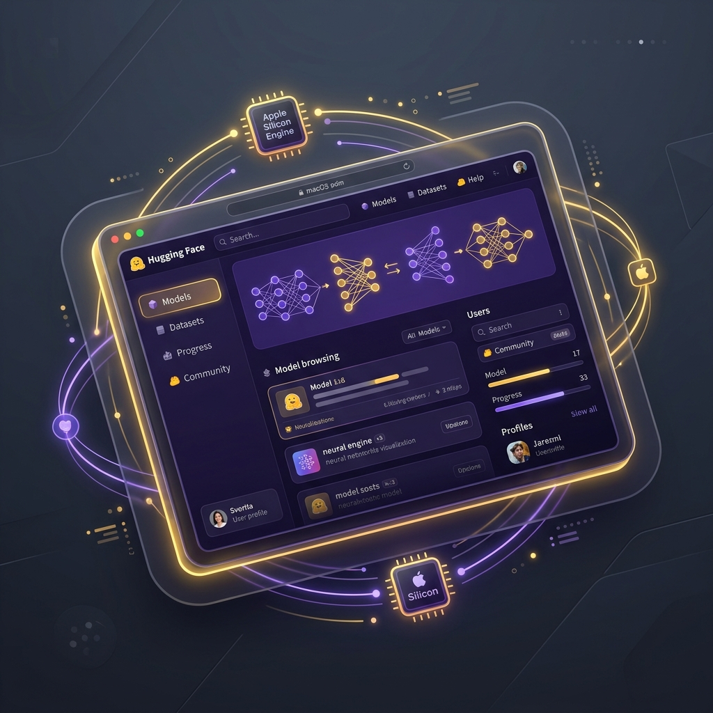

# 🜂 hf.app — Native macOS Hugging Face Client



[](https://swift.org)
[-000000?logo=apple&logoColor=white)](https://apple.com)
[](LICENSE)
[](https://8b-is.github.io/hf-mac/)

Browse the Hugging Face Hub, run models **locally on Apple Silicon via [Osaurus](https://github.com/dinoki-ai/osaurus)**, and chat from a real workspace window *or* a menu-bar quick agent. `hf.app` is the thin, honest native front-end — Osaurus owns the weights, MLX, and serving.

🌐 **Website & Documentation:** [https://8b-is.github.io/hf-mac/](https://8b-is.github.io/hf-mac/)

---

## 🔄 The Loop


```
Browse HF Hub  →  Pull to Osaurus  →  Run & Chat Locally (Private)  →  Manage Models
```

---

## ✨ Features

- ⚡ **Apple Silicon Unified Memory Performance**: Driven by Osaurus over localhost:1337 OpenAI-compatible `/v1` endpoints.
- 🤗 **Live Hugging Face Search**: Discover open-weight LLMs, filter by tags, and explore model cards in real-time.
- 🜂 **Dual Native macOS UI**: Switch seamlessly between a full SwiftUI app window (`WindowGroup`) and a lightweight menu-bar quick assistant (`MenuBarExtra`).
- 🔐 **100% On-Device Privacy**: Zero telemetry, no cloud dependency for inference. API tokens stay encrypted in the macOS Keychain.


---

## 🚀 Quick Start (Dev)

### Prerequisites
1. **macOS 14.0+** (Sonoma or later) on Apple Silicon or Intel.
2. **[Osaurus](https://github.com/dinoki-ai/osaurus)** installed and running on `localhost:1337`.

### Run via SwiftPM
```bash
# Clone the repository
git clone https://github.com/8b-is/hf-mac.git
cd hf-mac

# Run dev target
swift run
```

> **Note:** Pull your desired model inside Osaurus first, then hit **Refresh** in the **Run** tab of `hf.app`.

---

## 🛠️ Architecture


The application architecture is strictly modularized into thin, reactive components:

| Component | Responsibility |
|---|---|
| [`Services.swift`](file:///Users/peter.lodri/workspace/peterlodri-sec/hf-mac/Sources/HFMac/Services.swift) | `HubClient` (HF Hub REST API search/metadata) · `OsaurusClient` (Osaurus `/v1` OpenAI API for models & chat completion) |
| [`HFMacApp.swift`](file:///Users/peter.lodri/workspace/peterlodri-sec/hf-mac/Sources/HFMac/HFMacApp.swift) | `@main App` entry point configuring `WindowGroup` and `MenuBarExtra` with a unified `@Observable AppState` |
| [`Views.swift`](file:///Users/peter.lodri/workspace/peterlodri-sec/hf-mac/Sources/HFMac/Views.swift) | SwiftUI views for Browse, Run, Your Models, and the Menu Bar Agent popover |
| [`Keychain.swift`](file:///Users/peter.lodri/workspace/peterlodri-sec/hf-mac/Sources/HFMac/Keychain.swift) | Secure storage wrapper for Hugging Face User Access Tokens using macOS Keychain |

The app never embeds MLX directly — it drives Osaurus. Everything heavy stays in the engine.

---

## 📦 Building & Publishing

Refer to [`PUBLISHING.md`](file:///Users/peter.lodri/workspace/peterlodri-sec/hf-mac/PUBLISHING.md) for details on notarized Developer-ID DMG releases and Mac App Store packaging.

To build a notarized release DMG locally or via CI:
```bash
git tag v0.1.0
git push --tags
```

---

## 🚦 Roadmap & Status

- [x] **MVP:** Live Hugging Face Hub search, live local chat via Osaurus, menu-bar quick agent.
- [x] **GH Pages & Documentation:** Web landing page, architecture graphics, automated deployment workflow.
- [ ] **Keychain Integration:** One-click HF token sign-in → your private models and Spaces.
- [ ] **One-Click Pull-to-Osaurus:** Download models directly into Osaurus from `hf.app`.
- [ ] **1-Bit / Ternary Models:** Native support for `rivaquant` on-device quantization models.

---

🜂 *ahogy a dolgok vannak* — on-device, private, real tokens/sec, no fake states.
