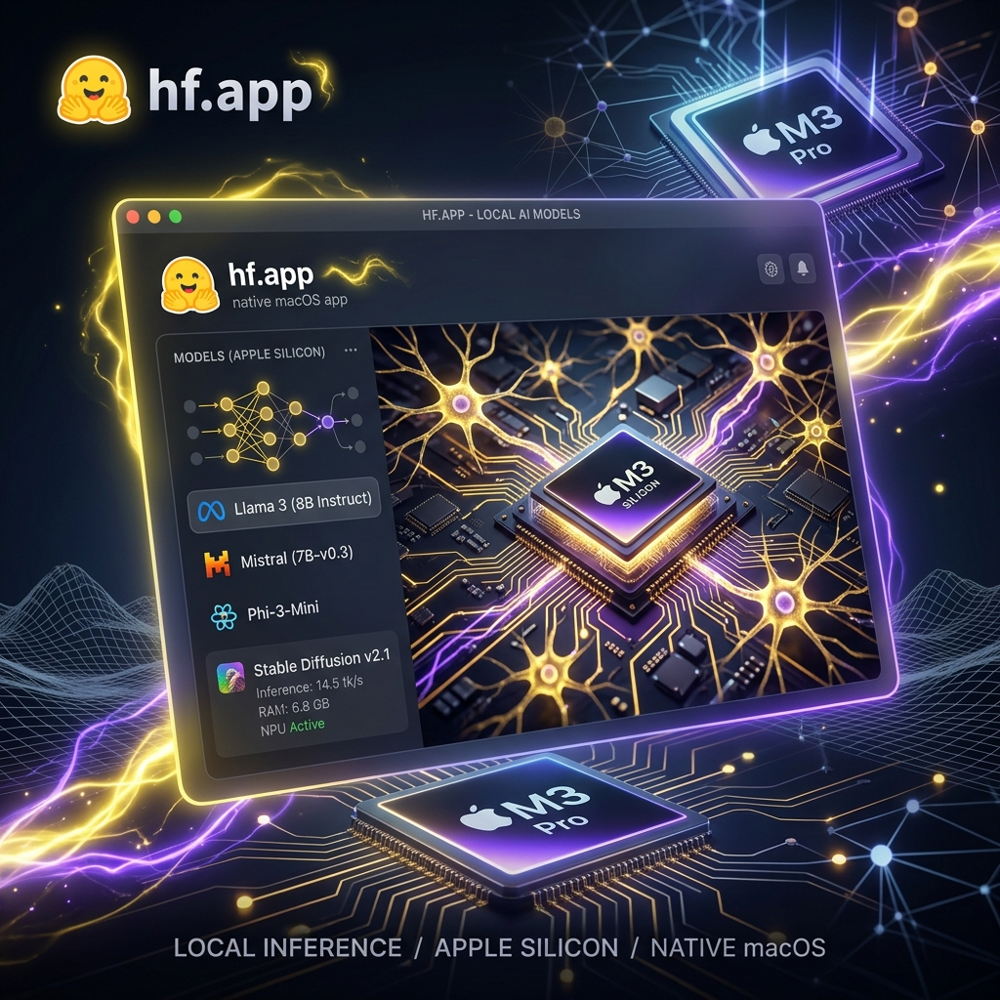
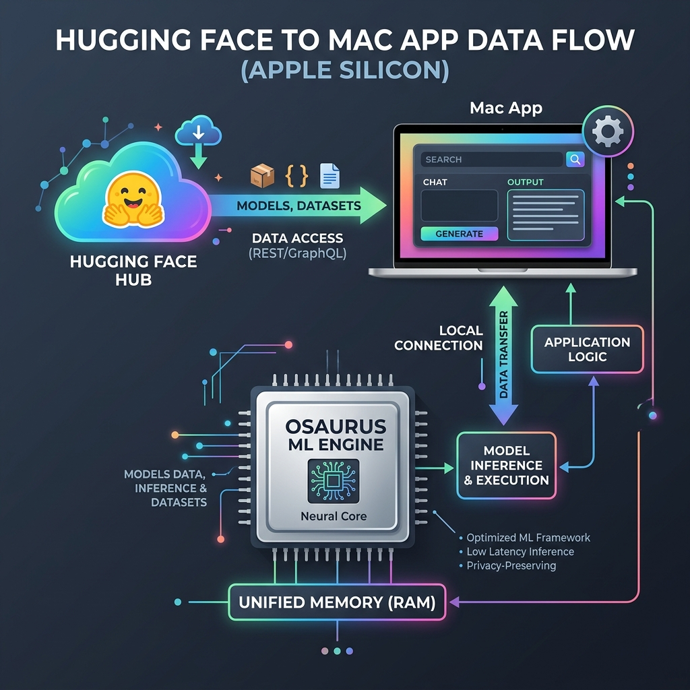

# 🜂 hf.app — Native macOS Hugging Face Client



[](https://swift.org)
[-000000?logo=apple&logoColor=white)](https://apple.com)
[](LICENSE)
[](https://8b-is.github.io/hf-mac/)
[](SECURITY.md)
[](CONTRIBUTING.md)

Browse the Hugging Face Hub, run models **locally on Apple Silicon via [Osaurus](https://github.com/osaurus-ai/osaurus)**, and chat from a real workspace window *or* a menu-bar quick agent. `hf.app` is the thin, honest native front-end — the unified macOS surface for the **8b-is stack**: Osaurus (inference), entheai (agent), MEM8 (wave memory), MLX-QUANT (ternary Metal kernels), and ayeOS (ternary inference daemon).

🌐 **Official Web Site & Documentation:** [https://8b-is.github.io/hf-mac/](https://8b-is.github.io/hf-mac/)

---

## 📑 Table of Contents

- [Vision & Philosophy](#-vision--philosophy)
- [Key Features](#-key-features)
- [System Requirements & Memory Guide](#-system-requirements--memory-guide)
- [Architecture & Data Flow](#-architecture--data-flow)
- [Codebase Structure](#-codebase-structure)
- [Quick Start](#-quick-start)
- [Osaurus Companion Setup](#-osaurus-companion-setup)
- [Security & Data Sovereignty](#-security--data-sovereignty)
- [Building & Distribution](#-building--distribution)
- [Contributing & Community](#-contributing--community)
- [License](#-license)

---

## 🜂 Vision & Philosophy

> *ahogy a dolgok vannak* — on-device, private, real tokens/sec, no fake states.

Most AI desktop applications suffer from bloated electron wrappers, bundled Python environments, or secret telemetry scripts. **`hf.app`** was built with a different philosophy:

1. **Honest Front-End Architecture**: The native Swift application handles user interaction, Hugging Face Hub discovery, and macOS UI integration. It never embeds MLX or Python runtimes directly.
2. **Dedicated Engine Separation**: Local model execution, weights caching, and MLX quantization are delegated entirely to **Osaurus** — an optimized local inference engine running on `localhost:1337`.
3. **Data Sovereignty**: Your prompts, conversations, and downloaded weights stay on your machine. Zero cloud telemetry.

---

## ✨ Key Features

| Feature | Description |
|---|---|
| ⚡ **Apple Silicon Native** | Built with pure Swift 5.9 and SwiftUI for macOS 14.0+, leveraging M1/M2/M3/M4 unified memory for maximum token throughput. |
| 🤗 **Live HF Hub Explorer** | Search millions of open-weight models directly from Hugging Face REST APIs with live metadata, model tags, and pull triggers. |
| 🜂 **Dual Native macOS UI** | Work in a standard desktop application window (`WindowGroup`) or invoke the lightweight menu-bar quick assistant (`MenuBarExtra`) anytime. |
| 🧠 **MoE Optimizer Layer** | Automatically classifies prompt intent (Code, Math & Reasoning, Summarization, Creative) and routes to specialized local models with expert system prompts. |
| 🔐 **Keychain Token Isolation** | Securely encrypt and store Hugging Face User Access Tokens in the system macOS Keychain using `Security.framework`. |
| 🌊 **MEM8 Wave Memory** | On-device wave interference recall — MEM8 frequency-band classification with entheai-aligned scoring. Zero network. |
| 🔺 **ayeOS Ternary Ready** | `ModelSpeed` badges ternary matrices at 12.80× compression via ayeOS MEMNET daemon. |
| 🧠 **entheai Agent** | Spawn entheai subprocess for fan-out decomposition, code analysis, project-wide ops — Ecosystem tab. |
| 🜂 **Ecosystem Tab** | Unified dashboard: Osaurus · entheai · ayeOS · MEM8 · MLX-QUANT — all status at a glance. |
| 🌐 **Offline First** | Once local models are pulled into Osaurus, chat and prompt inference operate completely offline with no network requirement. |


---

## 💻 System Requirements & Memory Guide

### Minimum Requirements
- **Operating System**: macOS 14.0 (Sonoma) or later.
- **Processor**: Apple Silicon (M1/M2/M3/M4) or Intel Mac with dedicated Metal GPU.
- **Local Engine**: [Osaurus](https://github.com/osaurus-ai/osaurus) running on `localhost:1337`.

### Recommended Memory Allocation for Local Models

| Model Size | Recommended RAM | Suggested Quantization | Example Models |
|---|---|---|---|
| **3B – 7B Parameters** | 8 GB – 16 GB | 4-bit / 8-bit MLX | Llama 3 8B, Phi-3-Mini, Mistral 7B |
| **8B – 14B Parameters** | 16 GB – 32 GB | 4-bit MLX | Qwen 2.5 14B, Gemma 2 9B |
| **30B – 70B Parameters** | 36 GB – 128 GB | 4-bit / 6-bit MLX | Llama 3.3 70B, Qwen 2.5 32B |

---

## 🏗️ Architecture & Data Flow



The system loop follows a clear 6-step pipeline:

```
Browse HF Hub  →  Pull to Osaurus  →  MoE Auto-Route  →  MEM8 Recall  →  ayeOS Ternary  →  Run & Chat (Private)
```

1. **Browse**: `HubClient` queries the Hugging Face REST API (`api-inference.huggingface.co`) for model cards, tags, and creator metadata.
2. **Pull**: Model weights are downloaded and cached by **Osaurus** into unified memory.
3. **MoE Optimize**: `MoEOptimizer` classifies prompt intent into domain experts (Code, Reasoning, Summary, Creative) and selects the best local model.
4. **MEM8 Recall**: `EntheaiMemory` retrieves relevant past spans via wave interference scoring — frequency proximity × amplitude × phase alignment.
5. **ayeOS Ternary**: Ternary models (BitNet b1.58, MLX-QUANT) route through ayeOS's `{n+-1-<△>}` inference daemon — deterministic LINOSV-seeded matrices, block-sparse matmul at 12.80× compression. `ModelSpeed.ternary` badges them instantly.
6. **Run & Chat**: `OsaurusClient` streams OpenAI-compatible `/v1/chat/completions` SSE to SwiftUI glass components.

---

## 📂 Codebase Structure


The codebase is organized into clean, single-responsibility Swift modules:

```
Sources/HFMac/
├── HFMacApp.swift      # @main App entry point, WindowGroup & MenuBarExtra setup
├── MoEOptimizer.swift  # Mixture of Experts intent classifier & dynamic model router
├── Services.swift      # HubClient (HF Hub REST) & OsaurusClient (OpenAI /v1 API)
├── Views.swift         # SwiftUI view hierarchy (Browse, Run, Your Models, MenuBar agent)
├── Keychain.swift      # Security.framework wrapper for HF tokens
├── Memory.swift        # MEM8 wave-based recall engine (on-device, zero network)
├── OfflineStore.swift   # Local persistence & cached model state
├── WebView.swift       # WKWebView bridge for interactive model cards & Spaces
├── VoiceEngine.swift   # On-device TTS/STT (Apple-native, sidecar-ready)
├── ModelSpeed.swift    # Model quantization speed classification
└── Theme.swift         # Modern macOS dark glass mode tokens & styling constants
```

### Key Modules

- [`MoEOptimizer.swift`](Sources/HFMac/MoEOptimizer.swift): Implements domain classification (`ExpertDomain`) and intelligent expert model routing.
- [`Services.swift`](Sources/HFMac/Services.swift): Contains `HubClient` for Hugging Face REST search and `OsaurusClient` for local OpenAI-compatible endpoint communication.
- [`HFMacApp.swift`](Sources/HFMac/HFMacApp.swift): The main application definition managing reactive `@Observable AppState`.
- [`Views.swift`](Sources/HFMac/Views.swift): Defines SwiftUI components for browsing, chatting, model management, and the floating menu-bar quick agent.
- [`Keychain.swift`](Sources/HFMac/Keychain.swift): Implements secure OS-level keychain access (`dev.peterl.hfmac.token`).
- [`Memory.swift`](Sources/HFMac/Memory.swift): MEM8 wave-based recall engine — encodes spans as waves, scores relevance via interference.

---

## 🚀 Quick Start

### Option A: Pre-built Notarized DMG
Download the latest Developer-ID notarized `.dmg` release from our [Releases Page](https://github.com/8b-is/hf-mac/releases), open the disk image, and drag `HFMac.app` to your `Applications` folder.

### Option B: Build & Run from Source

```bash
# 1. Clone the repository
git clone https://github.com/8b-is/hf-mac.git
cd hf-mac

# 2. Compile and run with Swift Package Manager
swift run
```

Or open in Xcode:
```bash
open Package.swift
```

---

## 🔌 Osaurus Companion Setup

`hf.app` relies on **Osaurus** for local model serving:

1. Download and launch **[Osaurus](https://github.com/osaurus-ai/osaurus)** on your Mac.
2. Ensure Osaurus is listening on `http://localhost:1337`.
3. Pull your desired model inside Osaurus (e.g. `llama3:8b`).
4. Click **Refresh** in the **Run** tab of `hf.app` to instantly sync available local models.

---

## 🛡️ Security & Data Sovereignty

- **App Sandbox Entitlements**: Enforced via [`Packaging/hf-mac.entitlements`](Packaging/hf-mac.entitlements) (`com.apple.security.app-sandbox` and `com.apple.security.network.client`).
- **Zero Telemetry**: No tracking cookies, analytics SDKs, or diagnostic logging.
- **Keychain Security**: Hugging Face access tokens are encrypted in the macOS Keychain.
- See our full [`SECURITY.md`](SECURITY.md) policy for vulnerability disclosure guidelines.

---

## 📦 Building & Distribution

Build targets and notarization processes are documented in [`PUBLISHING.md`](PUBLISHING.md):

- **Direct Notarized DMG**: Automated build via `.github/workflows/release.yml` on `v*` tag pushes.
- **Mac App Store**: Scaffolded in `.github/workflows/mas.yml` for sandboxed App Store Connect upload.

---

## 🤝 Contributing & Community

Contributions are welcome! Please read our [`CONTRIBUTING.md`](CONTRIBUTING.md) guide for details on development setup, Swift style guidelines, and pull request procedures.

- **Found a bug?** Open an issue on [GitHub Issues](https://github.com/8b-is/hf-mac/issues).
- **Security concern?** Refer to [`SECURITY.md`](SECURITY.md).

---

## 📄 License

Distributed under the **MIT License**. See [`LICENSE`](LICENSE) for details.

---

🜂 *ahogy a dolgok vannak* — on-device, private, real tokens/sec, no fake states.
