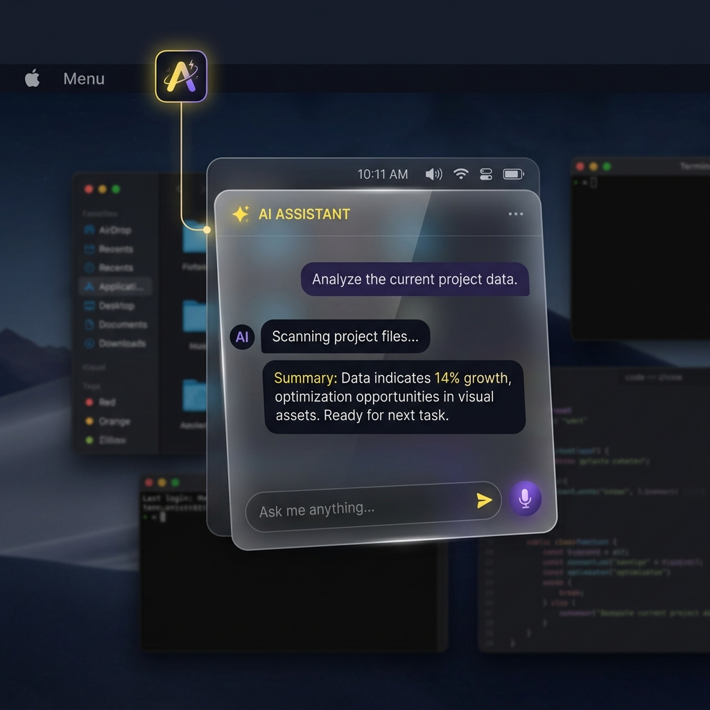

# Introducing hf.app: The Native macOS Hugging Face Client for Apple Silicon

*Browse the Hub, play Spaces on the desktop, and run open-weight models locally via Osaurus with zero telemetry and real Apple Silicon tokens/sec.*

---

## 🜂 Why a Native Client?

The open-source AI community has made breathtaking progress. Millions of developers and researchers rely on the **Hugging Face Hub** every day to discover new models, experiment with Spaces, and share open weights.

However, desktop experiences for AI models have often forced a compromise: heavy Electron wrappers, bundled Python runtimes with unpredictable dependencies, or closed cloud tools that send your private prompts to third-party servers.

We built **`hf.app`** with a simple, uncompromising philosophy (*ahogy a dolgok vannak* — as things are):

1. **Native Apple Silicon Speed**: Written in pure Swift 5.9 and SwiftUI for macOS 14.0+ (Sonoma), taking full advantage of M1/M2/M3/M4 unified memory architecture.
2. **Honest Front-End Architecture**: The desktop app handles user interaction, Hub search, and native macOS windowing. It never embeds bulky model runtimes directly.
3. **Dedicated Engine Separation**: Local model execution, weights caching, and MLX quantization are handled by **[Osaurus](https://github.com/osaurus-ai/osaurus)** — an optimized, open-source local inference engine running on `localhost:1337`.
4. **Complete Data Sovereignty**: Zero telemetry, zero external trackers, zero cloud dependency for inference. Your Hugging Face API tokens stay encrypted inside the system macOS Keychain.

---

## 🏗️ Clean Separation of Concerns


`hf.app` operates on an elegant four-stage loop:

```
Browse HF Hub  →  Pull to Osaurus  →  Run & Chat Locally (Private)  →  Manage Models
```

### The Codebase Stack (`Sources/HFMac/`)
The native client is built around seven focused Swift modules (~1,100 lines total):

- **`HFMacApp.swift`**: `@main` entry point configuring SwiftUI `WindowGroup` and `MenuBarExtra` with a unified `@Observable` reactive `AppState`.
- **`Services.swift`**: `HubClient` for Hugging Face REST APIs (`api-inference.huggingface.co`) and `OsaurusClient` for local OpenAI-compatible (`/v1/chat/completions`) endpoints.
- **`Views.swift`**: Native SwiftUI interface featuring **Spaces**, **Articles**, **Models**, **Run**, and **Yours** tabs, plus the menu-bar quick agent.
- **`Theme.swift`**: macOS liquid glass design system (`.ultraThinMaterial`, `.thinMaterial`, cyan highlights).
- **`Keychain.swift`**: Secure OS-level credential isolation using Apple's `Security.framework` (`dev.peterl.hfmac.token`).
- **`OfflineStore.swift`**: Local disk cache for static Space snapshots and offline article reading.
- **`WebView.swift`**: Translucent `WKWebView` bridge for desktop playback of Hugging Face Spaces.

---

## 🕹️ Desktop Spaces & Native Playability

One of the most exciting capabilities of `hf.app` is desktop playback of **Hugging Face Spaces**.

Whether it's a Gradio demonstration, a Streamlit utility, or a WebAssembly/WebGL interactive game (like quantum physics simulations), `hf.app` resolves the space's authoritative embed host (`*.hf.space`) and renders it inside a sandboxed macOS window.

Static Spaces can be downloaded directly to your local machine for **full offline playability** — perfect for travel or offline research.

---

## 💬 Dual Native Interface: Window + Menu Bar Agent

`hf.app` offers two seamless interaction modes:

1. **Workspace Window**: A full multi-column desktop application for model exploration, model card reading, offline articles, and extended local model chat sessions.
2. **Menu Bar Agent (`MenuBarExtra`)**: A floating macOS top-bar popover accessible from anywhere with a quick hotkey. Need a fast code snippet, translation, or text summary? Open the agent, ask your local model, and return to your work without changing window context.



---

## 🛡️ Security & Privacy Architecture

Privacy is not an opt-in toggle; it is enforced by the operating system:

- **App Sandbox Entitlements**: Enforced via `com.apple.security.app-sandbox` and `com.apple.security.network.client`. Outbound network access is strictly limited to Hugging Face REST endpoints and `localhost:1337`.
- **Keychain Security**: Hugging Face Access Tokens are stored with `kSecClassGenericPassword` in your macOS Keychain. Tokens are never written to disk in plaintext.
- **Zero Analytics**: No Google Analytics, Mixpanel, or crash reporting telemetry.

---

## 🚀 Quick Start

### 1. Download the Notarized DMG
Download the latest Developer-ID signed and notarized `.dmg` build directly from the [GitHub Releases](https://github.com/8b-is/hf-mac/releases/latest) page:

- **Version**: `v0.2.0`
- **Architecture**: Apple Silicon (`arm64`)
- **Requirement**: macOS 14.0 Sonoma or later

Drag `hf.app` to your `/Applications` directory. Because it is notarized and stapled by Apple, it launches instantly without Gatekeeper overrides.

### 2. Connect Osaurus Engine
Launch **[Osaurus](https://github.com/osaurus-ai/osaurus)** on `localhost:1337`. Pull any open model (e.g. `llama3:8b`, `qwen2.5-coder`, `mistral-7b`), then open `hf.app` and hit **Refresh** in the *Run* tab.

### 3. Build from Source (Developers)
```bash
git clone https://github.com/8b-is/hf-mac.git
cd hf-mac
swift run
```

---

## 🌐 Community & Roadmap

`hf.app` is 100% open source under the MIT License.

- **Official Website & Docs**: [https://8b-is.github.io/hf-mac/](https://8b-is.github.io/hf-mac/)
- **GitHub Repository**: [https://github.com/8b-is/hf-mac](https://github.com/8b-is/hf-mac)
- **Security Policy**: [`SECURITY.md`](https://github.com/8b-is/hf-mac/blob/main/SECURITY.md)
- **Contributing Guide**: [`CONTRIBUTING.md`](https://github.com/8b-is/hf-mac/blob/main/CONTRIBUTING.md)

### What's Next?
- **1-Bit & Ternary Model Support**: Integration with `rivaquant` on-device quantization models.
- **One-Click Pull-to-Osaurus**: Trigger direct local downloads from Hugging Face model cards.
- **Mac App Store Track**: Live record `hf.app` (Apple ID `6794829098`) preparing for App Store distribution.

---

🜂 *ahogy a dolgok vannak* — on-device, private, real tokens/sec, no fake states.
